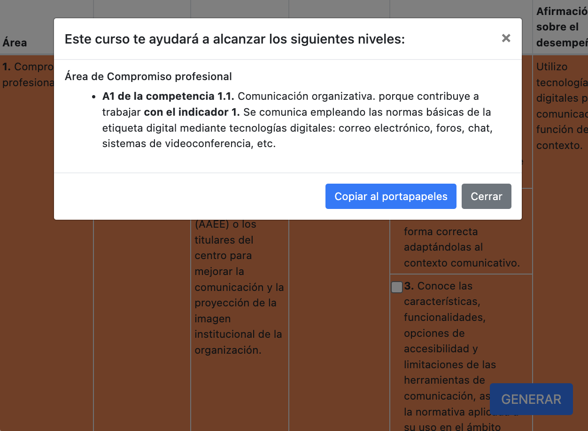

# CDD-Generator

CDD-Generator es una herramienta web para generar los indicadores de la competencia digital docente. Puedes acceder al generador de indicadores en el sitio web cdd-generator.ernesto.es.




## Cómo utilizarlo
1. Abre la página web en tu navegador.
2. Selecciona las casillas correspondientes a las competencias e indicadores deseados.
3. Haz clic en el botón "Generar".
4. La página web generará un texto con las competencias e indicadores seleccionados.
## Funcionalidades
- Genera un texto con las competencias e indicadores seleccionados.
- Interfaz amigable para el usuario con casillas para seleccionar competencias e indicadores.
- Utiliza Bootstrap para la presentación y el diseño.
- Utiliza jQuery para la manipulación del DOM.

## Estructura del archivo YAML

Se ha realizado una adaptación en formato YAML del Marco de Referencia de la Competencia Digital Docente publicado en la [Resolución de 4 de mayo de 2022, de la Dirección General de Evaluación y Cooperación Territorial, por la que se publica el Acuerdo de la Conferencia Sectorial de Educación, sobre la actualización del marco de referencia de la competencia digital docente](https://www.boe.es/diario_boe/txt.php?id=BOE-A-2022-8042) . Esta adaptación está diseñada para facilitar el uso con herramientas automatizadas.

La estructura del archivo YAML es la siguiente:

```yml

marco_referencia_competencia_digital_docente:
  - area: (número del área)
    titulo: (título del área)
    competencias:
      - competencia: (número de la competencia)
        titulo: (título de la competencia)
        etapas:
          - etapa: (letra de la etapa)
            titulo: (título de la etapa)
            niveles:
              - nivel: (código del nivel)
                titulo: (título del nivel)
                indicadores_logro:
                  - indicador: (código del indicador)
                    titulo: (título del indicador)
                afirmaciones_desempeño: (afirmación sobre el desempeño)
                ejemplos:
                  - (ejemplo)
```

## Cómo depurar en local

1. Asegúrate de tener Node.js instalado en tu computadora.
2. Navega hasta la carpeta de tu proyecto utilizando el comando `cd`.
3. Instala `http-server` utilizando el comando `npm install http-server`. 
4. Ejecuta `http-server` en la carpeta de tu proyecto utilizando el comando `http-server`.
5. Abre tu navegador web y accede a la dirección URL que se muestra en la terminal para ver tu proyecto y depurar cualquier problema que encuentres.


## Dependencias 
- [Bootstrap](https://getbootstrap.com/) : un popular framework para el desarrollo front-end en la web. 
- [jQuery](https://jquery.com/) : una biblioteca JavaScript rápida, pequeña y rica en características para la manipulación del DOM. 
- [js-yaml](https://github.com/nodeca/js-yaml) : una biblioteca JavaScript para analizar y volcar YAML. 
- [clipboard.js](https://clipboardjs.com/) : una biblioteca JavaScript ligera para copiar texto en el portapapeles.
## Licencia

Este proyecto se publica bajo la licencia [Creative Commons Attribution 4.0 International (CC BY 4.0)](https://creativecommons.org/licenses/by/4.0/) .